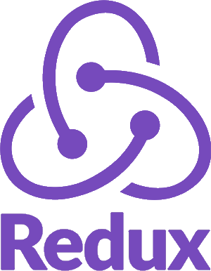

<h2>👋 Introduction </h2>
<ul>
  <li>Software engineer with Bachelor’s degree in computer science.</li>
  <li>Skilled in creating web applications.</li>
  <li>Dedicated to creating efficient, well-functioning software.</li>
  <li>Focuses on delivering intuitive, pixel-perfect user experiences.</li>
  <li>Passionate about technology and coding with energy and enthusiasm</li>
</ul>

<h2>Projects:</h2>
<a href="https://leogytis.github.io/">Portfolio page</a> 
<a href="https://leogytis.github.io/e-study/">E-study (project with TypeScript/React and Styled-components)</a> 
<a href="https://leogytis.github.io/braintech/">Braintech (Plain JavaScript coolaborate project at BIT coding school)</a> 
<a href="https://leogytis.github.io/gridster/">Gridster (Pathfinding project to show use cases of libraries)</a> 

<h2>Languages & Tools:</h2>

  

<h2>More about me:</h2>

👨‍🍳 Kitchen Chef (+10 years)

🏍️ Motorcycling 3 seasons

🤿 ScubaDiving +600 dives (Lithuanian lakes, Red Sea, Norwegian coast)

🏂 Snowboarding 2 seasons (Norway, Stranda)

🪁 KiteBoarding (from 8 knots to 40knots at Norway, Vigra island)

🤿 Freediving (PB's: 51m depth, 6:53min static, 75m Fins, 50 noFins)

🛩️ SkyDiving (75 Jumps)
⛰️ Hiking (Countless of kilometers)

🧉&nbsp;  Pottery

🌱 Gardening

🐈 Cat owner

<h2>Reach me out:</h2>
&nbsp;
 &nbsp;

