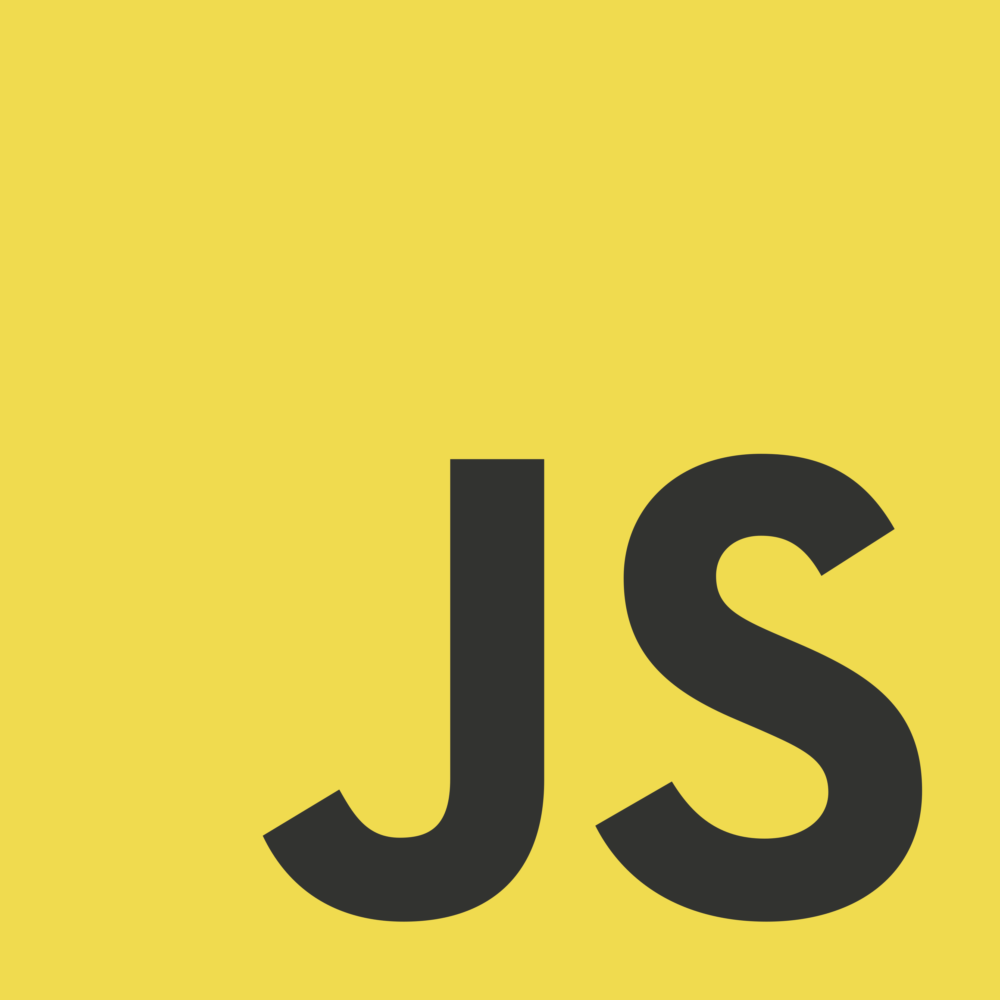

<h2>Projects:</h2> 
<a href="https://leogytis.github.io/">My portfolio page</a> 
<a href="https://leogytis.github.io/e-study/">Styled-components project with React</a> 
<a href="https://leogytis.github.io/braintech/">BIT school collaborate project with plain JavaScript</a> 
<a href="https://leogytis.github.io/gridster/">Gridster</a> 

<h2 align="left">Languages & Tools:</h2>

 
 

 
 
 

 

<h2>Reach me out</h2> 

